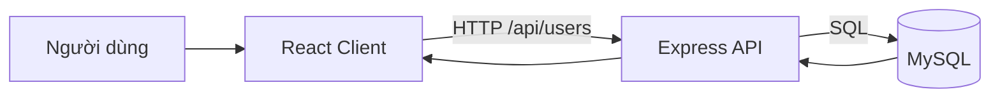
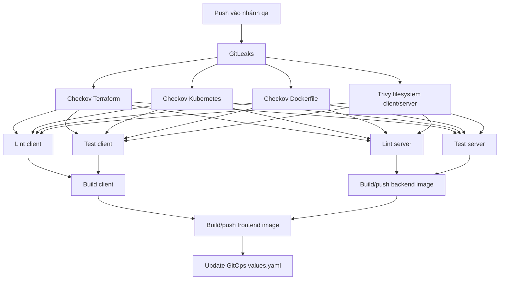

# 3-Tier User Platform

Ứng dụng quản lý người dùng theo mô hình 3 tầng, gồm giao diện React, REST API chạy trên Node.js/Express và cơ sở dữ liệu MySQL. Ứng dụng hỗ trợ hiển thị danh sách người dùng và tạo người dùng mới trên giao diện; API backend cung cấp đầy đủ các thao tác CRUD cơ bản.

## Mục lục

- [Tổng quan](#tổng-quan)
- [Kiến trúc](#kiến-trúc)
- [Chức năng](#chức-năng)
- [Công nghệ](#công-nghệ)
- [Cấu trúc thư mục](#cấu-trúc-thư-mục)
- [Yêu cầu hệ thống](#yêu-cầu-hệ-thống)
- [Chạy local](#chạy-local)
- [Chạy bằng Docker](#chạy-bằng-docker)
- [API reference](#api-reference)
- [Cấu hình cơ sở dữ liệu](#cấu-hình-cơ-sở-dữ-liệu)
- [QA và CI/CD](#qa-và-cicd)
- [Phân tích chất lượng mã nguồn](#phân-tích-chất-lượng-mã-nguồn)
- [Giới hạn hiện tại](#giới-hạn-hiện-tại)

## Tổng quan

### Mục tiêu

Repo cung cấp một nền tảng mẫu để thực hành và minh họa:

- Xây dựng frontend React được đóng gói bằng Webpack.
- Xây dựng REST API với Express và MySQL.
- Tách các lớp giao diện, API và dữ liệu.
- Đóng gói frontend bằng Nginx và backend bằng Docker.
- Chuẩn bị báo cáo phân tích mã nguồn với SonarCloud.

### Luồng xử lý



## Kiến trúc

| Tầng | Thành phần | Trách nhiệm |
| --- | --- | --- |
| Presentation | React 17, CSS, Webpack | Nhập dữ liệu, gửi request và hiển thị danh sách người dùng |
| Application/API | Node.js, Express, CORS | Cung cấp REST API, xử lý request và giao tiếp với MySQL |
| Data | MySQL 8+ tương thích | Lưu trữ bảng `users` |

Backend khởi động từ `server/server.js` và mặc định lắng nghe tại `http://localhost:5000`. Khi kết nối thành công, backend tự tạo bảng `users` nếu bảng chưa tồn tại.

## Chức năng

### Đang hoạt động

- Tải danh sách người dùng từ `GET /api/users`.
- Tạo người dùng mới từ form trên React client.
- Lưu các trường `name`, `email` và `role`.
- Phân quyền dữ liệu ở mức role với hai giá trị `Admin` và `User`.
- CORS và JSON body parsing ở backend.
- Phục vụ static frontend từ thư mục `client/public` khi chạy backend.

### Có trong backend/API

- Cập nhật người dùng bằng `PUT /api/users/:id`.
- Xóa người dùng bằng `DELETE /api/users/:id`.
- Ràng buộc email không trùng ở MySQL.

## Công nghệ

- **Frontend:** React 17, React DOM, Axios, Webpack 5, Babel.
- **Backend:** Node.js 18+, Express 4, MySQL2, CORS.
- **Container:** Docker, Nginx Alpine, Node Alpine.
- **Quality:** SonarCloud thông qua `sonar-project.properties`.

## Cấu trúc thư mục

```text
.
├── client/
│   ├── src/
│   │   ├── api/users.js          # Các hàm gọi API bằng Axios
│   │   ├── components/           # Component danh sách và item người dùng
│   │   ├── App.js                # Màn hình quản lý người dùng hiện tại
│   │   └── index.js              # React entry point
│   ├── public/                   # index.html và bundle được tạo bởi Webpack
│   ├── Dockerfile                # Build React, sau đó serve bằng Nginx
│   ├── package.json
│   └── webpack.config.js
├── server/
│   ├── config/db.js              # Cấu hình kết nối MySQL dùng cho route module
│   ├── controllers/              # Controller mẫu
│   ├── models/                   # Model truy vấn users
│   ├── routes/                   # Route module cho API
│   ├── server.js                 # Entrypoint đang được Docker và npm start sử dụng
│   ├── app.js                    # Express app module bổ trợ
│   └── Dockerfile
├── sonar-project.properties
└── README.md
```

## Yêu cầu hệ thống

- Node.js 18 trở lên và npm.
- MySQL 8 trở lên hoặc phiên bản tương thích với `mysql2`.
- Docker (tùy chọn).
- SonarScanner và tài khoản SonarCloud (chỉ cần khi chạy phân tích chất lượng).

## Chạy local

### 1. Chuẩn bị MySQL

Tạo database và user tương ứng, ví dụ:

```sql
CREATE DATABASE test_db;
CREATE USER 'appuser'@'localhost' IDENTIFIED BY 'password123';
GRANT ALL PRIVILEGES ON test_db.* TO 'appuser'@'localhost';
FLUSH PRIVILEGES;
```

Backend sẽ tự tạo bảng `users` khi khởi động. Không cần chạy migration riêng.

### 2. Khởi động backend

```powershell
cd server
npm ci
$env:DB_HOST = "localhost"
$env:DB_USER = "appuser"
$env:DB_PASSWORD = "password123"
$env:DB_NAME = "test_db"
$env:PORT = "5000"
npm start
```

API sẽ chạy tại `http://localhost:5000` và cũng có thể phục vụ frontend đã build trong `client/public`.

### 3. Khởi động frontend ở chế độ phát triển

Mở terminal khác:

```powershell
cd client
npm ci
npm start
```

`npm start` chạy Webpack ở development mode và tạo lại `client/public/bundle.js`. Vì frontend gọi API bằng đường dẫn tương đối `/api/users`, cách đơn giản để chạy đầy đủ là mở `http://localhost:5000` sau khi build frontend, hoặc cấu hình dev proxy trước khi dùng dev server riêng.

Để tạo bundle production:

```powershell
cd client
npm run build
```

## Chạy bằng Docker

Repo hiện cung cấp Dockerfile riêng cho client và server, chưa cung cấp `docker-compose.yml`. Cần có một MySQL container hoặc MySQL server có thể truy cập từ backend.

### Build image

```powershell
docker build -t user-platform-server ./server
docker build -t user-platform-client ./client
```

### Chạy backend container

Ví dụ khi MySQL chạy trong Docker với network `user-platform` và có service/container name là `mysql`:

```powershell
docker network create user-platform
docker run -d --name mysql --network user-platform `
	-e MYSQL_DATABASE=test_db `
	-e MYSQL_USER=appuser `
	-e MYSQL_PASSWORD=password123 `
	-e MYSQL_ROOT_PASSWORD=change-me `
	mysql:8

docker run --rm --name user-platform-server --network user-platform `
	-p 5000:5000 `
	-e DB_HOST=mysql `
	-e DB_USER=appuser `
	-e DB_PASSWORD=password123 `
	-e DB_NAME=test_db `
	-e PORT=5000 `
	user-platform-server
```

### Chạy frontend container

```powershell
docker run --rm --name user-platform-client -p 8080:80 user-platform-client
```

Lưu ý: Nginx trong `client/Dockerfile` hiện chỉ serve static files và chưa proxy `/api` sang backend. Vì vậy, frontend container độc lập tại `http://localhost:8080` sẽ không tự kết nối API ở cổng 5000. Khi triển khai container hóa hoàn chỉnh, cần bổ sung Nginx reverse proxy hoặc cấu hình API URL phù hợp.

## API reference

Base URL: `http://localhost:5000/api`

| Method | Endpoint | Mô tả | Body |
| --- | --- | --- | --- |
| `GET` | `/users` | Lấy toàn bộ người dùng | Không có |
| `POST` | `/users` | Tạo người dùng | `{ "name": "An", "email": "an@example.com", "role": "User" }` |
| `PUT` | `/users/:id` | Cập nhật người dùng | Các trường `name`, `email`, `role` |
| `DELETE` | `/users/:id` | Xóa người dùng | Không có |

### Ví dụ gọi API

```powershell
curl http://localhost:5000/api/users

curl -Method Post http://localhost:5000/api/users `
	-ContentType "application/json" `
	-Body '{"name":"An Nguyen","email":"an@example.com","role":"User"}'

curl -Method Put http://localhost:5000/api/users/1 `
	-ContentType "application/json" `
	-Body '{"name":"An Nguyen","email":"an.nguyen@example.com","role":"Admin"}'

curl -Method Delete http://localhost:5000/api/users/1
```

### Mô hình dữ liệu

| Cột | Kiểu | Ràng buộc |
| --- | --- | --- |
| `id` | `INT` | Primary key, tự tăng |
| `name` | `VARCHAR(255)` | Bắt buộc |
| `email` | `VARCHAR(255)` | Bắt buộc, duy nhất |
| `role` | `ENUM('Admin', 'User')` | Bắt buộc |

Các lỗi truy vấn hoặc dữ liệu không hợp lệ hiện được trả về với HTTP `500` và JSON dạng `{ "error": "..." }`.

## Cấu hình cơ sở dữ liệu

Backend đọc các biến môi trường sau:

| Biến | Mặc định trong `server.js` | Ý nghĩa |
| --- | --- | --- |
| `PORT` | `5000` | Cổng HTTP của API |
| `DB_HOST` | `localhost` | Host MySQL |
| `DB_USER` | `appuser` | Tài khoản MySQL |
| `DB_PASSWORD` | `password123` | Mật khẩu MySQL |
| `DB_NAME` | `test_db` | Tên database |

Không dùng mật khẩu mặc định trong môi trường production. Nên truyền secrets qua secret manager hoặc biến môi trường của nền tảng triển khai.

## QA và CI/CD

Pipeline được định nghĩa tại `.github/workflows/qa-cicd.yaml` với tên `CICD QA Workflow`.

### Điều kiện kích hoạt

Workflow chạy khi có `push` vào nhánh `qa` và thay đổi nằm trong một trong các phạm vi sau:

- `client/**`
- `server/**`
- `.github/workflows/qa-cicd.yaml`

### Các lớp kiểm tra



| Nhóm | Công cụ/công việc | Kết quả |
| --- | --- | --- |
| Secret scanning | GitLeaks | Tạo artifact `gitleaks-report.json` |
| IaC security | Checkov Terraform và Kubernetes | Tạo artifact JSON; hiện lệnh scan dùng `|| true` |
| Container security | Checkov Dockerfile và Trivy filesystem | Quét mức `HIGH`, `CRITICAL`, bỏ qua lỗ hổng chưa fix; tạo artifact |
| Code quality | `npm run lint --if-present` cho client/server | Chỉ chạy nếu package có script `lint` |
| Test | `npm test --if-present` cho client/server | Chỉ chạy nếu package có script `test` |
| Build | `npm run build --if-present` cho client | Tạo bundle frontend |
| Image delivery | Docker, Amazon ECR | Push image backend và frontend với tag commit SHA và `latest` |
| GitOps delivery | `yq` và repository IAC | Cập nhật tag image trong `k8s/frontend/values.yaml` và `k8s/backend/values.yaml` |

Các job build image chỉ chạy sau khi các bước scan, lint và test phụ thuộc hoàn tất. Sau khi hai image được push thành công, job `update-gitops-manifest` checkout repository `buicongthanh861/3-tier-user-platform-iac`, cập nhật image tag bằng `${GITHUB_SHA}`, commit và push lên nhánh `master`. ArgoCD có thể sử dụng thay đổi GitOps này để đồng bộ deployment Kubernetes.

### Secrets và quyền cần thiết

GitHub Actions cần các secrets sau:

| Secret | Mục đích |
| --- | --- |
| `AWS_ACCESS_KEY_ID` | Xác thực AWS |
| `AWS_SECRET_ACCESS_KEY` | Xác thực AWS |
| `AWS_REGION` | Region của ECR |
| `IAC_REPO_PAT` | Checkout và push repository GitOps |
| `SONARQUBE_TOKEN` | Chỉ cần khi bật job SonarCloud đang được comment |

Repository cần có hai ECR repository tương ứng:

- `3-tier-user-platform-backend`
- `3-tier-user-platform-frontend`

### Chạy các kiểm tra tương đương local

```powershell
# Dependencies và build
cd client
npm ci
npm run lint --if-present
npm test --if-present
npm run build --if-present

cd ..\server
npm ci
npm run lint --if-present
npm test --if-present
```

Các package hiện tại chưa khai báo script `lint` hoặc `test`, nên những bước có `--if-present` sẽ được bỏ qua. Đây là khoảng trống QA cần được bổ sung nếu pipeline phải thực sự kiểm tra chất lượng mã nguồn.

## Phân tích chất lượng mã nguồn

SonarCloud được cấu hình trong `sonar-project.properties` với project key `buicongthanh861_3-tier-user-platform`. File cấu hình hỗ trợ quét source của client và server, đồng thời khai báo đường dẫn coverage:

```text
client/coverage/lcov.info
server/coverage/lcov.info
```

SonarCloud đã có job mẫu trong workflow nhưng toàn bộ job đang được comment. Ngoài ra, package scripts chưa định nghĩa test hoặc coverage. Muốn kích hoạt quality gate, cần bổ sung test runner, tạo các file `lcov.info`, thêm secret `SONARQUBE_TOKEN` và bỏ comment job `sonarqube-scan`.

## Giới hạn hiện tại

- Giao diện `client/src/App.js` mới thực hiện tải danh sách và thêm người dùng. Nút **Edit** và **Delete** đang hiển thị nhưng chưa được nối vào handler API.
- Các module `server/app.js`, `server/routes/userRoutes.js`, controller và model là cấu trúc phân lớp bổ trợ; entrypoint hiện tại vẫn dùng các route inline trong `server/server.js`.
- Chưa có validation đầu vào ở tầng API cho email, role, trường bắt buộc và định dạng `id`.
- Chưa có authentication/authorization, rate limiting, logging tập trung hoặc health check.
- Chưa có test tự động và lint script; workflow CI/CD có bước gọi các lệnh này nhưng sẽ bỏ qua khi script chưa tồn tại.
- CORS hiện cho phép mọi origin thông qua `cors()` mặc định; cần giới hạn origin khi triển khai production.

## Định hướng mở rộng

1. Kết nối các thao tác Edit/Delete của React với API hiện có.
2. Hợp nhất entrypoint về kiến trúc route/controller/model và loại bỏ code trùng lặp.
3. Thêm validation, xử lý lỗi theo chuẩn thống nhất và health check cho database.
4. Bổ sung Docker Compose hoặc manifest triển khai có MySQL, backend, frontend và reverse proxy.
5. Thêm unit/integration tests, coverage và quality gate trong CI/CD.

## License

Chưa khai báo license cho repository này.
